```markdown
# 🚀 GigaTech Frontend

This is the **frontend** of the GigaTech project, built with **React**.  
It provides a modern, responsive, and interactive user interface.

---


## ⚡ Features

- Responsive and modern UI  
- Organized file structure  
- Built with React + Vite  
- Multiple pages (Home, About, Products, Careers, Login, etc.)  
- Ready for backend integration  

---

## 🛠️ Tech Stack

- **React 18**  
- **Vite** (fast dev server & build tool)  
- **JavaScript (ES6+)**  
- **CSS Modules / Plain CSS**  
- **Node.js + npm** for package management  

---

## 📦 Installation & Setup

1. **Clone the repository**
   ```bash
   git clone https://github.com/icarus-20s/giga-frontend.git
   cd giga-frontend
````

2. **Install dependencies**

   ```bash
   npm install
   ```

3. **Start development server**

   ```bash
   npm run dev
   ```

4. Open in browser: **[http://localhost:5173/](http://localhost:5173/)** 🚀

---

## 📸 Screenshots

<p align="center">
  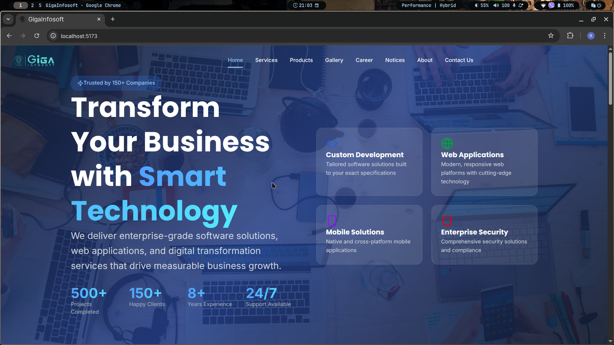
  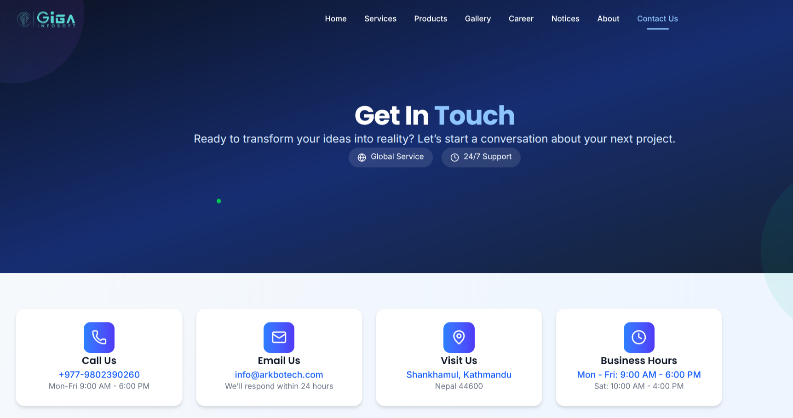
</p>

<p align="center">
  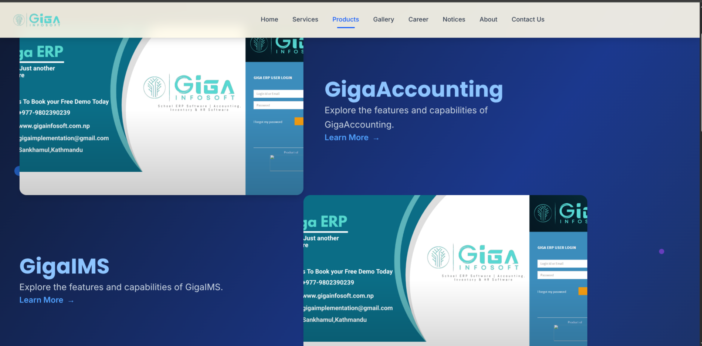
  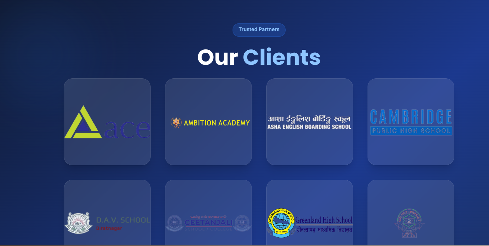
</p>

<p align="center">
  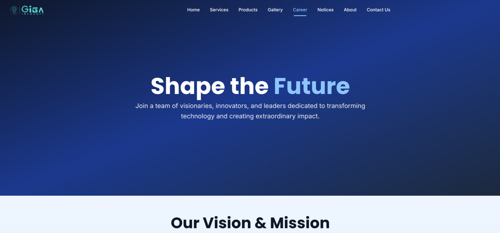
  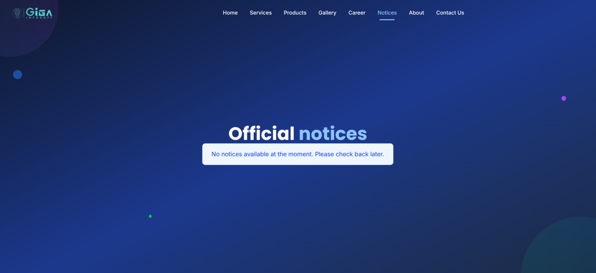
</p>

<p align="center">
  
  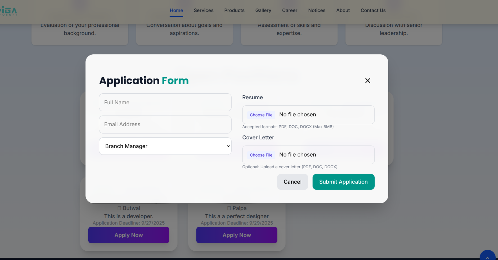
</p>

<p align="center">
  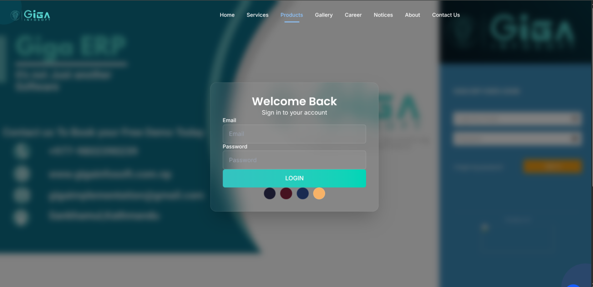
  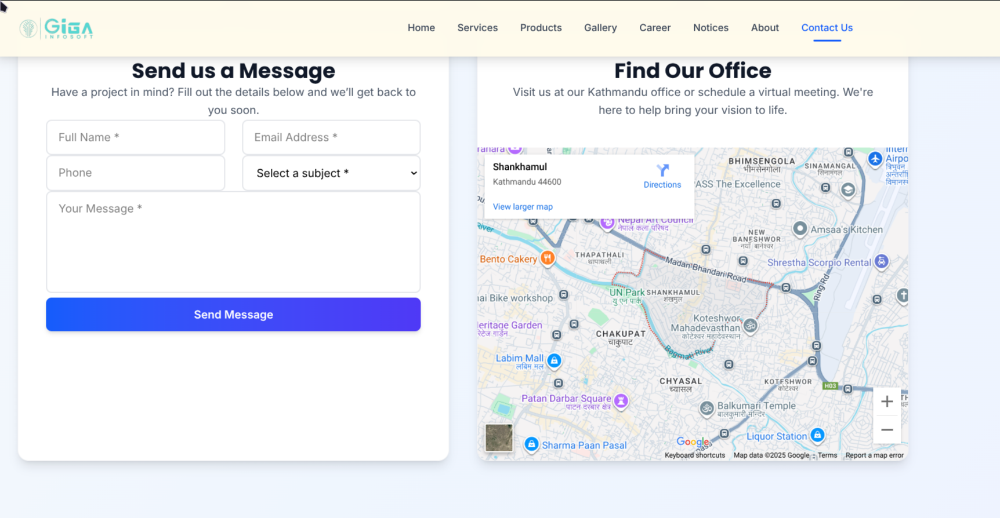
</p>

<p align="center">
  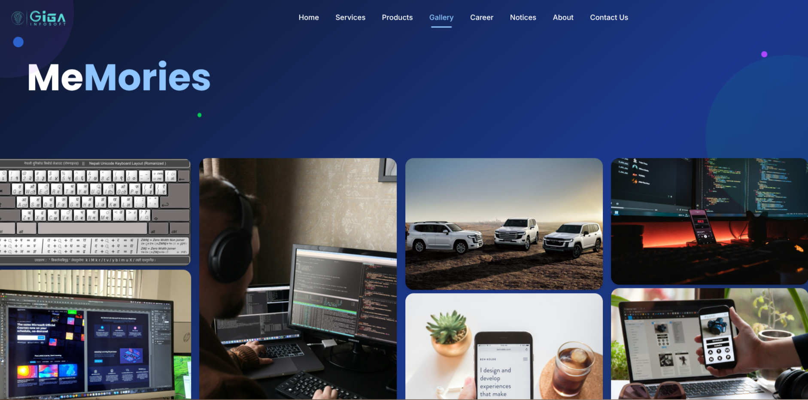
  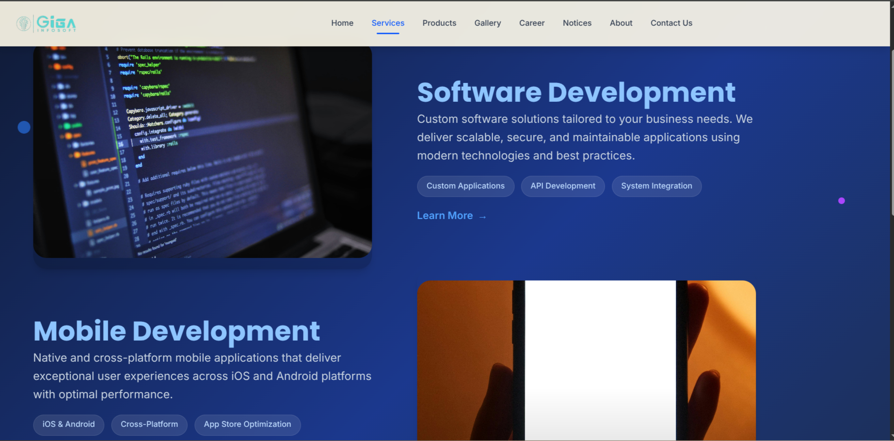
</p>

<p align="center">
  
  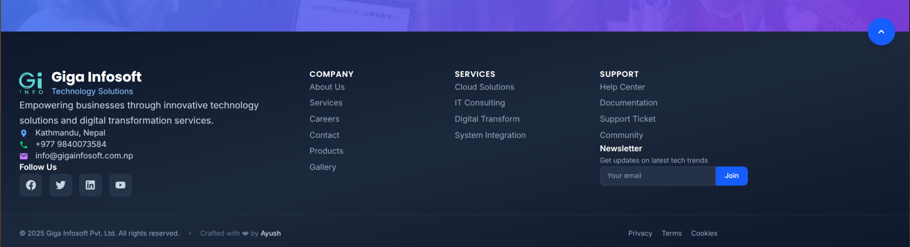
</p>

---

## 🤝 Contributing

1. Fork the repository
2. Create a new branch (`feature/your-feature`)
3. Commit your changes
4. Push and open a Pull Request

---

## 📜 License

This project is licensed under the **MIT License**.

---

## 👨‍💻 Author

* **Ayush (Icarus)** ✨
  [GitHub](https://github.com/icarus-20s)

```